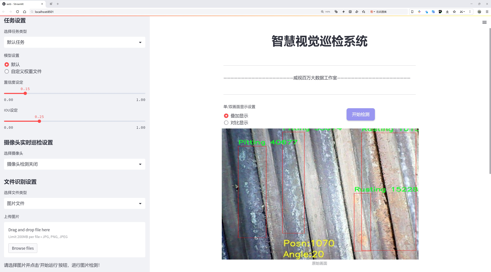
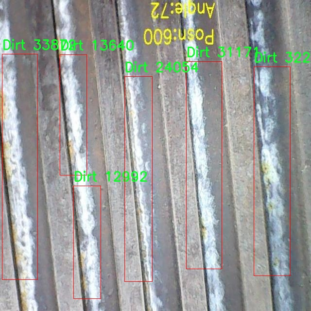

# 材料表面缺陷检测系统源码分享
 # [一条龙教学YOLOV8标注好的数据集一键训练_70+全套改进创新点发刊_Web前端展示]

### 1.研究背景与意义

项目参考[AAAI Association for the Advancement of Artificial Intelligence](https://gitee.com/qunmasj/projects)

项目来源[AACV Association for the Advancement of Computer Vision](https://github.com/qunshansj/good)

研究背景与意义

随着工业生产的不断发展，材料表面缺陷的检测与识别在保障产品质量、延长产品使用寿命以及降低生产成本等方面发挥着越来越重要的作用。传统的材料表面缺陷检测方法多依赖人工视觉检查和简单的图像处理技术，这些方法不仅效率低下，而且容易受到人为因素的影响，导致漏检和误检现象的发生。因此，如何提高材料表面缺陷检测的自动化水平和准确性，成为了材料科学与工程领域亟待解决的关键问题。

近年来，深度学习技术的迅猛发展为图像识别和目标检测提供了新的解决方案。YOLO（You Only Look Once）系列模型以其高效的实时检测能力和较高的准确率，逐渐成为目标检测领域的主流方法。特别是YOLOv8模型，凭借其在特征提取和处理速度上的显著提升，展现出了良好的应用前景。然而，针对材料表面缺陷的检测任务，现有的YOLOv8模型仍存在一定的局限性，主要体现在对复杂背景、不同光照条件及多种缺陷类型的适应能力不足。因此，基于改进YOLOv8的材料表面缺陷检测系统的研究具有重要的现实意义。

本研究将利用一个包含2132幅图像的特定数据集，涵盖了五类材料表面缺陷：剥落、污垢、凹坑、生锈和热裂纹。这些缺陷类型不仅在工业生产中普遍存在，而且各自具有不同的特征和表现形式，给检测带来了挑战。通过对这些缺陷的深入分析和特征提取，能够为改进YOLOv8模型提供丰富的训练数据，从而提升其在材料表面缺陷检测中的表现。

在研究过程中，我们将针对YOLOv8模型的特定结构进行优化，以增强其对多类缺陷的识别能力。通过引入改进的损失函数、数据增强技术以及迁移学习策略，力求提高模型在不同缺陷类型和复杂背景下的检测准确率。同时，研究还将探讨如何通过多尺度特征融合和上下文信息的引入，进一步提升模型的鲁棒性和适应性。

本研究的意义不仅在于提升材料表面缺陷检测的自动化水平，更在于为工业界提供一种高效、准确的检测工具，帮助企业降低生产成本、提高产品质量。此外，研究成果还将为后续的相关研究提供理论基础和实践参考，推动深度学习技术在材料科学领域的进一步应用。通过对材料表面缺陷的有效检测与识别，我们期望能够为实现智能制造和工业4.0的目标贡献一份力量。

### 2.图片演示





##### 注意：由于此博客编辑较早，上面“2.图片演示”和“3.视频演示”展示的系统图片或者视频可能为老版本，新版本在老版本的基础上升级如下：（实际效果以升级的新版本为准）

  （1）适配了YOLOV8的“目标检测”模型和“实例分割”模型，通过加载相应的权重（.pt）文件即可自适应加载模型。

  （2）支持“图片识别”、“视频识别”、“摄像头实时识别”三种识别模式。

  （3）支持“图片识别”、“视频识别”、“摄像头实时识别”三种识别结果保存导出，解决手动导出（容易卡顿出现爆内存）存在的问题，识别完自动保存结果并导出到tempDir中。

  （4）支持Web前端系统中的标题、背景图等自定义修改，后面提供修改教程。

  另外本项目提供训练的数据集和训练教程,暂不提供权重文件（best.pt）,需要您按照教程进行训练后实现图片演示和Web前端界面演示的效果。

### 3.视频演示

[3.1 视频演示](https://www.bilibili.com/video/BV1tiHNegEMz/?vd_source=ff015de2d29cbe2a9cdbfa7064407a08)

### 4.数据集信息展示

数据集信息展示

在现代工业生产中，材料表面缺陷的检测与识别至关重要，尤其是在保证产品质量和延长使用寿命方面。为此，针对材料表面缺陷的自动检测系统的研究逐渐成为热点。本文所展示的数据集，旨在为改进YOLOv8模型提供强有力的支持，以实现对材料表面缺陷的高效识别与分类。

该数据集名为“grayscale”，专门用于物体检测任务，包含2132幅图像，涵盖了五种不同的缺陷类别。这些类别分别是：Chipping（剥落）、Dirt（污垢）、Pitting（凹坑）、Rusting（生锈）和Thermal Cracking（热裂纹）。每一类缺陷在材料表面上都有其独特的视觉特征，这为训练深度学习模型提供了丰富的样本数据。

数据集中每一幅图像都经过精心挑选，确保其能够真实反映出材料表面缺陷的多样性和复杂性。比如，剥落的缺陷可能表现为表面材料的脱落，形成不规则的边缘；而污垢则可能呈现为细小的颗粒或斑点，影响材料的外观和性能。凹坑则可能由于外力作用而形成，通常呈现为凹陷的形状。生锈则是金属材料常见的缺陷，通常伴随着颜色的变化和表面质感的改变。热裂纹则是由于温度变化引起的材料应力集中，通常表现为细长的裂缝。

为了有效地训练YOLOv8模型，该数据集的图像数量和类别设置都经过了深思熟虑。2132幅图像的数量为模型提供了足够的样本量，使其能够学习到不同缺陷的特征和模式。同时，五个类别的划分使得模型在识别时能够进行更为细致的分类，进而提高检测的准确性和可靠性。

此外，该数据集采用了CC BY 4.0许可证，意味着用户可以自由使用、修改和分发数据集，只需适当引用原作者。这种开放的许可证政策不仅促进了学术界和工业界的合作，也为研究人员提供了便利，使其能够在此基础上进行进一步的研究和开发。

总之，grayscale数据集为改进YOLOv8的材料表面缺陷检测系统提供了坚实的基础。通过对2132幅图像的深入分析和训练，研究人员能够不断优化模型的性能，提升其在实际应用中的有效性。这一数据集不仅是材料表面缺陷检测领域的重要资源，也为相关技术的发展奠定了基础，推动了智能制造和自动化检测技术的进步。




### 5.全套项目环境部署视频教程（零基础手把手教学）

[5.1 环境部署教程链接（零基础手把手教学）](https://www.ixigua.com/7404473917358506534?logTag=c807d0cbc21c0ef59de5)


[5.2 安装Python虚拟环境创建和依赖库安装视频教程链接（零基础手把手教学）](https://www.ixigua.com/7404474678003106304?logTag=1f1041108cd1f708b01a)

### 6.手把手YOLOV8训练视频教程（零基础小白有手就能学会）

[6.1 环境部署教程链接（零基础手把手教学）](https://www.ixigua.com/7404477157818401292?logTag=d31a2dfd1983c9668658)

### 7.70+种全套YOLOV8创新点代码加载调参视频教程（一键加载写好的改进模型的配置文件）

[7.1 环境部署教程链接（零基础手把手教学）](https://www.ixigua.com/7404478314661806627?logTag=29066f8288e3f4eea3a4)

### 8.70+种全套YOLOV8创新点原理讲解（非科班也可以轻松写刊发刊，V10版本正在科研待更新）

由于篇幅限制，每个创新点的具体原理讲解就不一一展开，具体见下列网址中的创新点对应子项目的技术原理博客网址【Blog】：


[8.1 70+种全套YOLOV8创新点原理讲解链接](https://gitee.com/qunmasj/good)

### 9.系统功能展示（检测对象为举例，实际内容以本项目数据集为准）

图9.1.系统支持检测结果表格显示

  图9.2.系统支持置信度和IOU阈值手动调节

  图9.3.系统支持自定义加载权重文件best.pt(需要你通过步骤5中训练获得)

  图9.4.系统支持摄像头实时识别

  图9.5.系统支持图片识别

  图9.6.系统支持视频识别

  图9.7.系统支持识别结果文件自动保存

  图9.8.系统支持Excel导出检测结果数据


### 10.原始YOLOV8算法原理

原始YOLOv8算法原理

YOLOv8算法作为目标检测领域的最新代表，承载着YOLO系列模型的优良传统，同时在多个方面进行了创新与优化。其设计理念源于对实时目标检测需求的深刻理解，旨在实现高效、准确的目标识别。YOLOv8的架构分为三个主要部分：输入端、主干网络和检测端，每个部分都经过精心设计，以提升整体性能。

在主干网络方面，YOLOv8依然延续了跨级结构（Cross Stage Partial, CSP）的思想，这种结构的核心在于通过分割和合并特征图来提高网络的表达能力和梯度流动性。YOLOv8对YOLOv5中的C3模块进行了优化，采用了新的C2f模块，这一模块不仅轻量化，还增加了更多的残差连接，从而使得网络在保持低计算量的同时，能够获取更丰富的梯度信息。这种设计使得YOLOv8在特征提取的过程中，能够更好地捕捉到不同层次的特征，尤其是在处理复杂场景时，表现出色。

YOLOv8的特征融合策略依然基于特征金字塔网络（PAN-FPN），但在上采样阶段，算法删除了传统的卷积结构，简化了网络的复杂性。这一改进使得特征融合更加高效，同时减少了计算开销。通过这样的设计，YOLOv8能够在不同尺度的特征图之间进行有效的信息传递，从而提升检测精度。

在检测端，YOLOv8引入了新的解耦合头结构，分类和检测任务被分离处理，这种解耦合设计有助于提升模型的灵活性和性能。与传统的Anchor-Based方法不同，YOLOv8采用了Anchor-Free的检测策略，这一策略不仅简化了模型的训练过程，还提高了在不同目标尺寸下的检测能力。通过去除之前的objectness分支，YOLOv8的检测头结构更加简洁，专注于分类和回归任务的优化。

损失函数的设计是YOLOv8的另一大创新点。YOLOv8引入了变焦损失（Focal Loss）来计算分类损失，并结合数据平均保真度损失和完美交并比损失（CIoU Loss）来计算边界框损失。这种新的损失策略使得模型在训练过程中能够更好地处理类别不平衡问题，提升了小目标的检测性能。通过精细化的损失计算，YOLOv8在目标检测的准确性上取得了显著提升。

YOLOv8还在数据增强方面进行了创新，采用了动态任务对齐分配策略（Task-Aligned Assigner），在训练的最后10个epoch中关闭马赛克增强。这一策略使得模型在训练后期能够更加专注于特定任务的优化，从而提升了最终的检测效果。

YOLOv8的多样化模型设计也值得一提。根据不同的应用场景，YOLOv8提供了五种不同规模的模型（n、s、m、l、x），每种模型在深度和特征图宽度上有所不同，以适应不同的计算资源和性能需求。这种灵活性使得YOLOv8能够在从移动设备到高性能服务器的各种硬件平台上运行，满足了广泛的应用需求。

总的来说，YOLOv8算法在继承YOLO系列优良传统的基础上，通过一系列创新和优化，显著提升了目标检测的效率和准确性。其轻量化的设计、解耦合的检测头、精细化的损失计算以及灵活的模型选择，使得YOLOv8成为当前计算机视觉领域中最先进的目标检测模型之一。通过这些改进，YOLOv8不仅能够在复杂的场景中实现高效的目标检测，还为后续的研究和应用提供了广阔的空间。


### 11.项目核心源码讲解（再也不用担心看不懂代码逻辑）

#### 11.1 ultralytics\nn\modules\utils.py

以下是经过简化和注释的核心代码部分：

```python
import copy
import math
import numpy as np
import torch
import torch.nn as nn
import torch.nn.functional as F
from torch.nn.init import uniform_

def multi_scale_deformable_attn_pytorch(
    value: torch.Tensor,
    value_spatial_shapes: torch.Tensor,
    sampling_locations: torch.Tensor,
    attention_weights: torch.Tensor,
) -> torch.Tensor:
    """
    多尺度可变形注意力机制。
    
    参数:
    - value: 输入特征图，形状为 (batch_size, channels, num_heads, embed_dims)
    - value_spatial_shapes: 特征图的空间形状，形状为 (num_levels, 2)
    - sampling_locations: 采样位置，形状为 (batch_size, num_queries, num_heads, num_levels, num_points, 2)
    - attention_weights: 注意力权重，形状为 (batch_size, num_heads, num_queries, num_levels, num_points)

    返回:
    - output: 经过注意力机制处理后的输出，形状为 (batch_size, num_queries, num_heads * embed_dims)
    """

    # 获取输入的基本维度
    bs, _, num_heads, embed_dims = value.shape
    _, num_queries, _, num_levels, num_points, _ = sampling_locations.shape
    
    # 将输入特征图按照空间形状分割成多个特征图
    value_list = value.split([H_ * W_ for H_, W_ in value_spatial_shapes], dim=1)
    
    # 计算采样网格
    sampling_grids = 2 * sampling_locations - 1
    sampling_value_list = []
    
    # 遍历每个特征图层级
    for level, (H_, W_) in enumerate(value_spatial_shapes):
        # 对每个层级的特征图进行处理
        value_l_ = value_list[level].flatten(2).transpose(1, 2).reshape(bs * num_heads, embed_dims, H_, W_)
        
        # 处理当前层级的采样位置
        sampling_grid_l_ = sampling_grids[:, :, :, level].transpose(1, 2).flatten(0, 1)
        
        # 使用双线性插值从特征图中采样
        sampling_value_l_ = F.grid_sample(
            value_l_, sampling_grid_l_, mode="bilinear", padding_mode="zeros", align_corners=False
        )
        
        # 将采样结果添加到列表中
        sampling_value_list.append(sampling_value_l_)
    
    # 调整注意力权重的形状
    attention_weights = attention_weights.transpose(1, 2).reshape(
        bs * num_heads, 1, num_queries, num_levels * num_points
    )
    
    # 计算最终输出
    output = (
        (torch.stack(sampling_value_list, dim=-2).flatten(-2) * attention_weights)
        .sum(-1)
        .view(bs, num_heads * embed_dims, num_queries)
    )
    
    return output.transpose(1, 2).contiguous()  # 返回输出，调整维度顺序
```

### 代码注释说明：
1. **函数定义**：`multi_scale_deformable_attn_pytorch` 是实现多尺度可变形注意力机制的核心函数。
2. **参数说明**：详细描述了输入参数的含义和形状。
3. **特征图分割**：使用 `split` 方法将输入特征图根据空间形状分割成多个特征图，以便于后续处理。
4. **采样网格计算**：通过对采样位置进行变换，得到适合于特征图的采样网格。
5. **双线性插值**：使用 `F.grid_sample` 从特征图中根据采样网格进行插值，得到对应的特征值。
6. **注意力权重调整**：对注意力权重进行维度调整，以便与采样结果进行正确的计算。
7. **输出计算**：通过加权求和得到最终的输出结果，并调整输出的维度顺序以符合预期格式。

这个文件是一个与Ultralytics YOLO相关的模块，主要包含一些实用的函数和类，涉及到深度学习模型的构建和初始化。首先，文件导入了一些必要的库，包括`copy`、`math`、`numpy`和`torch`，这些库为后续的操作提供了基础功能。

文件中定义了几个函数。第一个函数`_get_clones(module, n)`用于克隆给定的模块，返回一个包含n个深拷贝的模块列表。这在构建具有相同结构的多个层时非常有用，比如在实现多头注意力机制时。

接下来的函数`bias_init_with_prob(prior_prob=0.01)`用于根据给定的概率值初始化卷积或全连接层的偏置值。它使用了负对数几率的公式来计算偏置值，这种初始化方式可以帮助模型更快地收敛。

`linear_init(module)`函数用于初始化线性模块的权重和偏置。它根据模块的权重形状计算一个边界值，并使用均匀分布在这个边界内随机初始化权重和偏置。这种初始化方法有助于保持模型的稳定性。

`inverse_sigmoid(x, eps=1e-5)`函数计算输入张量的反sigmoid函数。它首先将输入限制在0到1之间，然后计算反sigmoid值。这个函数在某些模型中可能用于特定的损失计算或概率转换。

最后，`multi_scale_deformable_attn_pytorch`函数实现了多尺度可变形注意力机制。这个函数接收多个输入，包括值张量、空间形状、采样位置和注意力权重。它首先对输入进行形状转换，然后根据采样位置使用双线性插值从值张量中采样。接着，函数计算加权和以得到最终的输出。这个过程涉及到对多头注意力的处理，使得模型能够在不同尺度上进行特征提取。

整体来看，这个文件的功能主要集中在深度学习模型的模块化构建、参数初始化以及实现复杂的注意力机制上，适用于需要处理多尺度特征的视觉任务。

#### 11.2 ultralytics\models\fastsam\utils.py

以下是经过简化和注释的核心代码部分：

```python
import torch

def adjust_bboxes_to_image_border(boxes, image_shape, threshold=20):
    """
    调整边界框，使其在接近图像边缘时粘附到图像边界。

    参数:
        boxes (torch.Tensor): 边界框坐标，形状为 (n, 4)
        image_shape (tuple): 图像的高度和宽度，形状为 (height, width)
        threshold (int): 像素阈值，决定边界框是否需要调整

    返回:
        adjusted_boxes (torch.Tensor): 调整后的边界框
    """
    h, w = image_shape  # 获取图像的高度和宽度

    # 根据阈值调整边界框的坐标
    boxes[boxes[:, 0] < threshold, 0] = 0  # 如果左上角x坐标小于阈值，则设置为0
    boxes[boxes[:, 1] < threshold, 1] = 0  # 如果左上角y坐标小于阈值，则设置为0
    boxes[boxes[:, 2] > w - threshold, 2] = w  # 如果右下角x坐标大于图像宽度减去阈值，则设置为图像宽度
    boxes[boxes[:, 3] > h - threshold, 3] = h  # 如果右下角y坐标大于图像高度减去阈值，则设置为图像高度
    return boxes  # 返回调整后的边界框

def bbox_iou(box1, boxes, iou_thres=0.9, image_shape=(640, 640), raw_output=False):
    """
    计算一个边界框与其他边界框的交并比（IoU）。

    参数:
        box1 (torch.Tensor): 单个边界框，形状为 (4, )
        boxes (torch.Tensor): 其他边界框，形状为 (n, 4)
        iou_thres (float): IoU阈值，用于筛选高IoU的边界框
        image_shape (tuple): 图像的高度和宽度，形状为 (height, width)
        raw_output (bool): 如果为True，则返回原始IoU值而不是索引

    返回:
        high_iou_indices (torch.Tensor): IoU大于阈值的边界框索引
    """
    boxes = adjust_bboxes_to_image_border(boxes, image_shape)  # 调整边界框到图像边界

    # 计算交集的坐标
    x1 = torch.max(box1[0], boxes[:, 0])  # 交集左上角x坐标
    y1 = torch.max(box1[1], boxes[:, 1])  # 交集左上角y坐标
    x2 = torch.min(box1[2], boxes[:, 2])  # 交集右下角x坐标
    y2 = torch.min(box1[3], boxes[:, 3])  # 交集右下角y坐标

    # 计算交集面积
    intersection = (x2 - x1).clamp(0) * (y2 - y1).clamp(0)  # clamp(0)确保不出现负值

    # 计算两个边界框的面积
    box1_area = (box1[2] - box1[0]) * (box1[3] - box1[1])  # box1的面积
    box2_area = (boxes[:, 2] - boxes[:, 0]) * (boxes[:, 3] - boxes[:, 1])  # boxes的面积

    # 计算并集面积
    union = box1_area + box2_area - intersection  # 并集面积

    # 计算IoU
    iou = intersection / union  # 交并比
    if raw_output:
        return 0 if iou.numel() == 0 else iou  # 如果需要原始IoU值，则返回

    # 返回IoU大于阈值的边界框索引
    return torch.nonzero(iou > iou_thres).flatten()
```

### 代码核心部分说明：
1. **adjust_bboxes_to_image_border**: 该函数用于调整边界框的位置，确保它们不会超出图像的边界。如果边界框的某个边缘距离图像边缘小于给定的阈值，则将其调整到图像边缘。

2. **bbox_iou**: 该函数计算一个边界框与一组其他边界框之间的交并比（IoU）。它首先调用 `adjust_bboxes_to_image_border` 函数来调整边界框，然后计算交集和并集的面积，最后返回满足IoU阈值条件的边界框索引。

这个程序文件是一个用于处理目标检测中边界框（bounding boxes）的工具模块，主要包含两个函数：`adjust_bboxes_to_image_border` 和 `bbox_iou`。

首先，`adjust_bboxes_to_image_border` 函数的作用是调整边界框的位置，使其在接近图像边界时，能够“粘附”到图像的边缘。函数接受三个参数：`boxes` 是一个形状为 (n, 4) 的张量，表示 n 个边界框的坐标；`image_shape` 是一个元组，包含图像的高度和宽度；`threshold` 是一个整数，表示在距离图像边缘的阈值。函数内部首先获取图像的高度和宽度，然后通过条件判断调整边界框的坐标。如果边界框的左上角坐标 (x1, y1) 小于阈值，则将其调整为 0；如果右下角坐标 (x2, y2) 超过图像的宽度或高度减去阈值，则将其调整为图像的宽度或高度。最后，返回调整后的边界框。

接下来，`bbox_iou` 函数用于计算一个边界框与一组其他边界框之间的交并比（IoU，Intersection over Union）。该函数接受五个参数：`box1` 是一个形状为 (4,) 的张量，表示要计算的边界框；`boxes` 是一个形状为 (n, 4) 的张量，表示其他边界框；`iou_thres` 是一个浮点数，表示 IoU 的阈值；`image_shape` 是图像的高度和宽度；`raw_output` 是一个布尔值，指示是否返回原始的 IoU 值。函数首先调用 `adjust_bboxes_to_image_border` 来调整其他边界框的位置。然后，通过计算交集的坐标，得出交集区域的面积。接着，计算两个边界框的面积，并根据交集和并集的面积计算 IoU 值。如果 `raw_output` 为真，则返回 IoU 值；否则，返回 IoU 大于阈值的边界框的索引。

整体来看，这个模块提供了处理边界框的基本功能，适用于目标检测任务中的边界框调整和重叠度计算。

#### 11.3 ui.py

```python
import sys
import subprocess

def run_script(script_path):
    """
    使用当前 Python 环境运行指定的脚本。

    Args:
        script_path (str): 要运行的脚本路径

    Returns:
        None
    """
    # 获取当前 Python 解释器的路径
    python_path = sys.executable

    # 构建运行命令
    command = f'"{python_path}" -m streamlit run "{script_path}"'

    # 执行命令
    result = subprocess.run(command, shell=True)
    if result.returncode != 0:
        print("脚本运行出错。")


# 实例化并运行应用
if __name__ == "__main__":
    # 指定您的脚本路径
    script_path = "web.py"  # 这里直接指定脚本路径

    # 运行脚本
    run_script(script_path)  # 调用函数执行脚本
```

### 代码注释说明：

1. **导入模块**：
   - `import sys`：导入系统相关的模块，用于获取当前 Python 解释器的路径。
   - `import subprocess`：导入子进程模块，用于在 Python 中执行外部命令。

2. **定义函数 `run_script`**：
   - 该函数接受一个参数 `script_path`，表示要运行的 Python 脚本的路径。
   - 使用 `sys.executable` 获取当前 Python 解释器的路径，以确保在当前环境中运行脚本。
   - 构建命令字符串，使用 `streamlit` 模块运行指定的脚本。
   - 使用 `subprocess.run` 执行构建的命令，并通过 `shell=True` 允许在 shell 中执行命令。
   - 检查命令执行的返回码，如果不为 0，表示执行出错，打印错误信息。

3. **主程序入口**：
   - `if __name__ == "__main__":`：确保只有在直接运行该脚本时才会执行以下代码。
   - 指定要运行的脚本路径 `script_path`，这里直接指定为 `"web.py"`。
   - 调用 `run_script` 函数，传入脚本路径，执行该脚本。

这个程序文件的主要功能是使用当前的 Python 环境来运行一个指定的脚本，具体来说是运行一个名为 `web.py` 的 Streamlit 应用。程序首先导入了必要的模块，包括 `sys`、`os` 和 `subprocess`，以及一个自定义的 `abs_path` 函数，用于获取文件的绝对路径。

在 `run_script` 函数中，首先获取当前 Python 解释器的路径，使用 `sys.executable` 来实现。接着，构建一个命令字符串，该命令使用当前的 Python 解释器来运行指定的脚本，命令格式为 `python -m streamlit run "script_path"`。然后，使用 `subprocess.run` 函数来执行这个命令，`shell=True` 参数允许在 shell 中执行命令。

如果脚本运行过程中出现错误，`result.returncode` 将不等于 0，程序会打印出“脚本运行出错”的提示信息。

在文件的最后部分，使用 `if __name__ == "__main__":` 语句来确保只有在直接运行该文件时才会执行后面的代码。这里指定了要运行的脚本路径为 `web.py`，并调用 `run_script` 函数来执行这个脚本。

总的来说，这个程序提供了一种简单的方式来启动一个 Streamlit 应用，确保使用的是当前 Python 环境，并处理可能出现的错误。

#### 11.4 train.py

以下是代码中最核心的部分，并附上详细的中文注释：

```python
import os
import torch
import yaml
from ultralytics import YOLO  # 导入YOLO模型库
from QtFusion.path import abs_path  # 导入路径处理函数

# 检查是否有可用的GPU，如果有则使用GPU，否则使用CPU
device = "0" if torch.cuda.is_available() else "cpu"

if __name__ == '__main__':  # 确保该模块被直接运行时才执行以下代码
    workers = 1  # 设置数据加载的工作进程数
    batch = 2    # 设置每个批次的大小

    data_name = "data"  # 数据集名称
    # 获取数据集配置文件的绝对路径
    data_path = abs_path(f'datasets/{data_name}/{data_name}.yaml', path_type='current')  
    unix_style_path = data_path.replace(os.sep, '/')  # 将路径转换为Unix风格

    # 获取数据集目录路径
    directory_path = os.path.dirname(unix_style_path)
    
    # 读取YAML格式的数据集配置文件
    with open(data_path, 'r') as file:
        data = yaml.load(file, Loader=yaml.FullLoader)
    
    # 如果配置文件中包含'path'项，则修改为当前目录路径
    if 'path' in data:
        data['path'] = directory_path
        # 将修改后的数据写回YAML文件
        with open(data_path, 'w') as file:
            yaml.safe_dump(data, file, sort_keys=False)

    # 加载YOLOv8模型的配置文件
    model = YOLO(model='./ultralytics/cfg/models/v8/yolov8s.yaml', task='detect')  
    
    # 开始训练模型
    results2 = model.train(
        data=data_path,  # 指定训练数据的配置文件路径
        device=device,  # 指定使用的设备（GPU或CPU）
        workers=workers,  # 指定数据加载的工作进程数
        imgsz=640,  # 指定输入图像的大小为640x640
        epochs=100,  # 指定训练的轮数为100
        batch=batch,  # 指定每个批次的大小
        name='train_v8_' + data_name  # 指定训练任务的名称
    )
```

### 代码核心部分解释：
1. **导入必要的库**：导入了处理文件路径、模型训练和数据读取所需的库。
2. **设备选择**：根据是否有可用的GPU选择训练设备。
3. **数据集配置**：读取YAML格式的数据集配置文件，并修改其中的路径项为当前目录路径。
4. **模型加载**：加载YOLOv8模型的配置文件。
5. **模型训练**：使用指定的参数开始训练模型，包括数据路径、设备、工作进程数、图像大小、训练轮数和批次大小。

这个程序文件 `train.py` 是用于训练 YOLOv8 模型的脚本。首先，程序导入了必要的库，包括 `os`、`torch`、`yaml` 和 `ultralytics` 中的 YOLO 模型。根据系统是否支持 CUDA，程序决定使用 GPU 还是 CPU 进行训练。

在 `__main__` 块中，程序首先设置了一些训练参数，如工作进程数 `workers` 和批次大小 `batch`。接着，程序定义了数据集的名称 `data_name`，并构建了数据集 YAML 文件的绝对路径。通过调用 `abs_path` 函数，程序获取了数据集 YAML 文件的完整路径，并将路径中的分隔符统一为 Unix 风格。

随后，程序获取了数据集目录的路径，并打开 YAML 文件以读取数据。读取后，程序检查 YAML 数据中是否包含 `path` 项，如果有，则将其修改为数据集的目录路径，并将更新后的数据写回 YAML 文件中，以确保后续的训练能够正确找到数据集。

接下来，程序加载了预训练的 YOLOv8 模型，指定了模型的配置文件。然后，程序调用 `model.train` 方法开始训练模型。在训练过程中，程序指定了多个参数，包括训练数据的配置文件路径、设备类型、工作进程数、输入图像的大小（640x640）、训练的 epoch 数（100）以及每个批次的大小（2）。最后，训练任务的名称也被指定为 `train_v8_` 加上数据集名称，以便于后续的识别和管理。

总的来说，这个脚本的主要功能是配置并启动 YOLOv8 模型的训练过程，确保数据集路径正确，并设置相关的训练参数。

#### 11.5 utils.py

以下是代码中最核心的部分，并附上详细的中文注释：

```python
import os
import cv2
import pandas as pd
import streamlit as st
from PIL import Image
from QtFusion.path import abs_path

def save_uploaded_file(uploaded_file):
    """
    保存上传的文件到服务器上。

    Args:
        uploaded_file (UploadedFile): 通过Streamlit上传的文件。

    Returns:
        str: 保存文件的完整路径，如果没有文件上传则返回 None。
    """
    # 检查是否有文件上传
    if uploaded_file is not None:
        base_path = "tempDir"  # 定义文件保存的基本路径

        # 如果路径不存在，创建这个路径
        if not os.path.exists(base_path):
            os.makedirs(base_path)
        # 获取文件的完整路径
        file_path = os.path.join(base_path, uploaded_file.name)

        # 以二进制写模式打开文件
        with open(file_path, "wb") as f:
            f.write(uploaded_file.getbuffer())  # 写入文件

        return file_path  # 返回文件路径

    return None  # 如果没有文件上传，返回 None


def concat_results(result, location, confidence, time):
    """
    显示检测结果。

    Args:
        result (str): 检测结果。
        location (str): 检测位置。
        confidence (str): 置信度。
        time (str): 检测用时。

    Returns:
        DataFrame: 包含检测结果的 DataFrame。
    """
    # 创建一个包含这些信息的 DataFrame
    result_data = {
        "识别结果": [result],
        "位置": [location],
        "置信度": [confidence],
        "用时": [time]
    }

    results_df = pd.DataFrame(result_data)  # 将结果数据转换为 DataFrame
    return results_df  # 返回结果 DataFrame


def get_camera_names():
    """
    获取可用摄像头名称列表。

    Returns:
        list: 返回包含“未启用摄像头”和可用摄像头索引号的列表。
    """
    camera_names = ["摄像头检测关闭", "0"]  # 初始化摄像头名称列表
    max_test_cameras = 10  # 定义要测试的最大摄像头数量

    # 测试每个摄像头索引，检查是否可用
    for i in range(max_test_cameras):
        cap = cv2.VideoCapture(i, cv2.CAP_DSHOW)  # 尝试打开摄像头
        if cap.isOpened() and str(i) not in camera_names:  # 如果摄像头打开成功且未在列表中
            camera_names.append(str(i))  # 添加摄像头索引到列表
            cap.release()  # 释放摄像头资源
    if len(camera_names) == 1:  # 如果只找到一个默认项
        st.write("未找到可用的摄像头")  # 提示用户未找到可用摄像头
    return camera_names  # 返回摄像头名称列表
```

### 代码核心部分解释：
1. **`save_uploaded_file` 函数**：用于保存用户上传的文件到服务器的指定目录中，确保目录存在并以二进制模式写入文件。
2. **`concat_results` 函数**：用于将检测结果、位置、置信度和用时信息整合成一个 Pandas DataFrame，方便后续的数据处理和展示。
3. **`get_camera_names` 函数**：检测系统中可用的摄像头，返回一个包含可用摄像头索引的列表，便于用户选择。

这些函数是实现文件上传、结果展示和摄像头检测的核心功能。

这个程序文件 `utils.py` 包含了一些实用的函数，主要用于处理文件上传、显示检测结果、加载默认图片以及获取可用摄像头的名称。

首先，文件中导入了一些必要的库，包括 `os`、`cv2`、`pandas`、`streamlit`、`PIL` 和 `QtFusion.path`。这些库提供了文件操作、图像处理、数据处理和用户界面等功能。

`save_uploaded_file` 函数用于保存用户通过 Streamlit 上传的文件。它首先检查是否有文件上传，如果有，则定义一个基本路径 `tempDir` 来保存文件。如果该路径不存在，函数会创建这个路径。接着，函数会获取上传文件的完整路径，并以二进制写模式打开文件，将其内容写入到指定路径中。最后，函数返回保存文件的完整路径，如果没有文件上传，则返回 `None`。

`concat_results` 函数用于显示检测结果。它接收检测结果、位置、置信度和检测用时作为参数，并将这些信息存储在一个 Pandas DataFrame 中。该函数返回一个包含这些信息的 DataFrame，方便后续的数据处理和展示。

`load_default_image` 函数用于加载一个默认的图片。它通过调用 `abs_path` 函数获取默认图片的路径，并使用 `Image.open` 方法打开这个图片，最后返回这个图片对象。

`get_camera_names` 函数用于获取可用摄像头的名称列表。它首先创建一个包含“摄像头检测关闭”和索引“0”的列表，然后定义一个最大测试摄像头数量的变量。接着，函数通过循环测试多个摄像头索引，使用 `cv2.VideoCapture` 尝试打开每个摄像头。如果成功打开，函数会将该摄像头的索引添加到列表中，并释放摄像头资源。如果没有找到可用的摄像头，函数会在 Streamlit 界面上显示相应的提示信息。最后，函数返回包含可用摄像头名称的列表。

总体来说，这个文件提供了一些基础的功能，方便在 Streamlit 应用中处理文件上传、展示检测结果、加载默认图片以及获取摄像头信息。

#### 11.6 ultralytics\models\yolo\segment\train.py

以下是代码中最核心的部分，并附上详细的中文注释：

```python
from ultralytics.models import yolo
from ultralytics.nn.tasks import SegmentationModel
from ultralytics.utils import DEFAULT_CFG, RANK
from ultralytics.utils.plotting import plot_images, plot_results

class SegmentationTrainer(yolo.detect.DetectionTrainer):
    """
    扩展自 DetectionTrainer 类的 SegmentationTrainer 类，用于基于分割模型的训练。
    """

    def __init__(self, cfg=DEFAULT_CFG, overrides=None, _callbacks=None):
        """初始化 SegmentationTrainer 对象，接受配置和重写参数。"""
        if overrides is None:
            overrides = {}
        overrides["task"] = "segment"  # 设置任务类型为分割
        super().__init__(cfg, overrides, _callbacks)  # 调用父类的初始化方法

    def get_model(self, cfg=None, weights=None, verbose=True):
        """返回初始化的 SegmentationModel 模型，使用指定的配置和权重。"""
        # 创建一个分割模型实例，通道数为3，类别数为数据集中类别的数量
        model = SegmentationModel(cfg, ch=3, nc=self.data["nc"], verbose=verbose and RANK == -1)
        if weights:
            model.load(weights)  # 如果提供了权重，则加载权重

        return model  # 返回模型实例

    def get_validator(self):
        """返回 SegmentationValidator 实例，用于验证 YOLO 模型。"""
        self.loss_names = "box_loss", "seg_loss", "cls_loss", "dfl_loss"  # 定义损失名称
        return yolo.segment.SegmentationValidator(
            self.test_loader, save_dir=self.save_dir, args=copy(self.args), _callbacks=self.callbacks
        )  # 返回验证器实例

    def plot_training_samples(self, batch, ni):
        """创建训练样本图像的绘图，包含标签和框坐标。"""
        plot_images(
            batch["img"],  # 训练样本图像
            batch["batch_idx"],  # 批次索引
            batch["cls"].squeeze(-1),  # 类别标签
            batch["bboxes"],  # 边界框
            masks=batch["masks"],  # 分割掩码
            paths=batch["im_file"],  # 图像文件路径
            fname=self.save_dir / f"train_batch{ni}.jpg",  # 保存图像的文件名
            on_plot=self.on_plot,  # 绘图回调
        )

    def plot_metrics(self):
        """绘制训练和验证指标的图表。"""
        plot_results(file=self.csv, segment=True, on_plot=self.on_plot)  # 保存结果图像
```

### 代码核心部分说明：
1. **导入必要的模块**：导入了 YOLO 模型、分割模型、默认配置和绘图工具等。
2. **SegmentationTrainer 类**：继承自 `DetectionTrainer`，用于处理分割任务的训练。
3. **初始化方法**：设置任务类型为分割，并调用父类的初始化方法。
4. **获取模型**：创建并返回一个分割模型实例，可以选择加载预训练权重。
5. **获取验证器**：返回一个用于验证模型性能的验证器实例，并定义损失名称。
6. **绘制训练样本**：生成包含训练样本图像、标签和边界框的图像，并保存。
7. **绘制指标**：绘制训练和验证过程中的指标图表。

这个程序文件 `train.py` 是用于训练基于 YOLO（You Only Look Once）模型的分割任务的。它继承自 YOLO 的检测训练器类 `DetectionTrainer`，并在此基础上扩展了分割模型的训练功能。

首先，文件导入了一些必要的模块和类，包括 YOLO 模型、分割模型、默认配置、排名工具以及用于绘图的函数。接着，定义了一个名为 `SegmentationTrainer` 的类，这个类专门用于处理图像分割的训练过程。

在 `SegmentationTrainer` 类的构造函数 `__init__` 中，首先检查是否提供了覆盖参数 `overrides`，如果没有，则初始化为空字典。然后，将任务类型设置为 "segment"，并调用父类的构造函数进行初始化。

`get_model` 方法用于返回一个初始化好的分割模型 `SegmentationModel`，该模型根据传入的配置和权重进行设置。如果提供了权重参数，则会加载相应的权重。

`get_validator` 方法返回一个用于验证 YOLO 模型的实例 `SegmentationValidator`，同时定义了损失名称，包括框损失、分割损失、分类损失和 DFL 损失。这个验证器会使用测试数据加载器和保存目录进行初始化。

`plot_training_samples` 方法用于生成训练样本的可视化图像，显示图像、标签和框坐标。它会调用 `plot_images` 函数，将训练批次的图像及其相关信息绘制到一张图中，并保存为 JPG 文件。

最后，`plot_metrics` 方法用于绘制训练和验证过程中的指标，调用 `plot_results` 函数生成相应的结果图，并保存为 PNG 文件。

整体来看，这个文件的主要功能是定义一个用于图像分割任务的训练器，提供了模型初始化、验证、可视化等功能，便于用户进行分割模型的训练和评估。

### 12.系统整体结构（节选）

### 程序整体功能和构架概括

该程序的整体功能是实现一个基于 YOLO（You Only Look Once）模型的目标检测和图像分割系统。程序包含多个模块和文件，每个文件负责特定的功能，从数据处理、模型训练到用户界面展示，形成一个完整的工作流。主要模块包括：

1. **模型训练**：包括 YOLO 模型的训练和分割模型的训练，支持参数配置和模型验证。
2. **实用工具**：提供文件处理、边界框调整、图像加载等功能，便于数据预处理和结果展示。
3. **用户界面**：使用 Streamlit 创建交互式界面，方便用户上传文件、查看检测结果和选择摄像头。
4. **性能评估**：通过计算指标和可视化工具，帮助用户评估模型的性能。

### 文件功能整理表

| 文件路径                                       | 功能描述                                                 |
|------------------------------------------------|----------------------------------------------------------|
| `ultralytics\nn\modules\utils.py`             | 提供模型克隆、参数初始化、反sigmoid计算和多尺度注意力机制等实用函数。 |
| `ultralytics\models\fastsam\utils.py`         | 处理边界框的调整和交并比计算，适用于目标检测任务。       |
| `ui.py`                                        | 启动 Streamlit 应用，运行指定的 `web.py` 脚本。          |
| `train.py`                                     | 配置并启动 YOLOv8 模型的训练过程，设置训练参数和数据集路径。 |
| `utils.py`                                     | 提供文件上传、检测结果展示、默认图片加载和摄像头信息获取等功能。 |
| `ultralytics\models\yolo\segment\train.py`    | 定义分割模型的训练器，处理模型初始化、验证和可视化等功能。  |
| `ultralytics\utils\metrics.py`                | 提供计算和评估模型性能的指标函数。                       |
| `ultralytics\utils\callbacks\raytune.py`      | 实现与 Ray Tune 结合的回调函数，用于超参数优化。         |
| `ultralytics\data\build.py`                   | 处理数据集的构建和预处理，确保数据格式适合模型训练。     |
| `log.py`                                       | 处理日志记录和输出，跟踪训练过程中的信息和错误。         |

这个表格总结了各个文件的主要功能，便于理解整个程序的架构和各模块之间的关系。

注意：由于此博客编辑较早，上面“11.项目核心源码讲解（再也不用担心看不懂代码逻辑）”中部分代码可能会优化升级，仅供参考学习，完整“训练源码”、“Web前端界面”和“70+种创新点源码”以“13.完整训练+Web前端界面+70+种创新点源码、数据集获取”的内容为准。

### 13.完整训练+Web前端界面+70+种创新点源码、数据集获取


https://mbd.pub/o/bread/ZpqXkppy